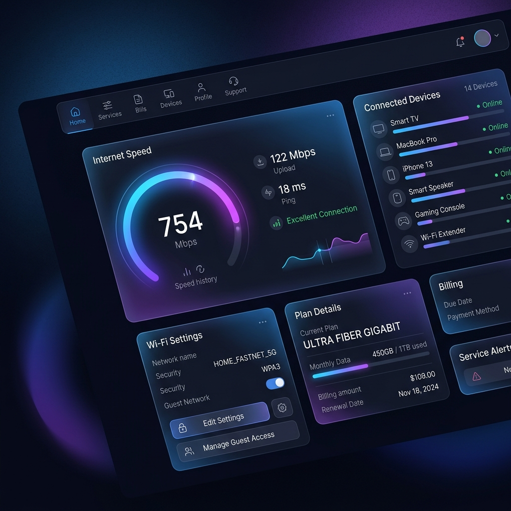

# 🚀 app-customer



Modern and responsive customer portal for ISPs using **GenieACS**. Provides self-service device management experience for your customers without admin intervention.

[](https://github.com/yourofficialisp/app-customer/blob/main/LICENSE)
[](https://github.com/yourofficialisp/app-customer/stargazers)
[](https://nodejs.org/)

---

## ✨ Main Features

- 🔐 **Passwordless Login**: Customers log in using unique ID/Tag (e.g., Phone Number or Customer ID) registered in GenieACS.
- 📊 **Real-time ONU Dashboard**:
  - Device Status (Online/Offline).
  - Signal Information (RX Power/Attenuation).
  - PPPoE Details (IP Address & Username).
  - Device Information (Model, Serial Number, Firmware Version).
  - ONU Uptime.
- 📶 **WiFi Self-Service**:
  - Change WiFi Name (SSID) independently.
  - Change WiFi Password (Min 8 characters).
  - Automatic Dual-Band configuration support (2.4GHz & 5GHz).
- 🔄 **Remote Management**:
  - Reboot device directly from dashboard.
  - Customer Tag/ID management.
- 📱 **Mobile Friendly**: Responsive UI using Bootstrap 5 with modern design and glassmorphism.
- 🛠️ **Automated Deployment**: Includes installer scripts for Ubuntu & Armbian.

---

## 🛠️ Tech Stack

- **Backend**: Node.js, Express.js
- **Templates**: EJS (Embedded JavaScript)
- **Styling**: Vanilla CSS, Bootstrap 5, Bootstrap Icons
- **Integration**: GenieACS REST API (v1.2+)
- **Process Manager**: PM2

---

## 🚀 Installation Guide (Ubuntu / Armbian)

The installer script will handle Node.js, PM2, dependencies, and initial configuration automatically.

### 1. Preparation
Make sure you have `root` or `sudo` access.

```bash
# Clone repository
git clone https://github.com/yourofficialisp/app-customer.git
cd app-customer

# Give execute permission to installer script
chmod +x install.sh
```

### 2. Run Installer
```bash
sudo bash install.sh
```

- Script will ask if you want to install Node.js (v18).
- Script will ask if you want to install PM2.
- `settings.json` file will be created automatically with GenieACS target to `localhost:7557`.

### 3. Complete
After successful installation, the portal can be accessed at:
`http://[IP-SERVER]:3001/login`

---

## ⚙️ Manual Configuration

If GenieACS is on a different server, you can edit the `settings.json` file:

```json
{
  "genieacs_url": "http://192.168.1.100:7557",
  "genieacs_username": "admin",
  "genieacs_password": "admin-password",
  "company_header": "NBB Wifiber",
  "footer_info": "Powered by CyberNet",
  "server_port": 3001,
  "server_host": "localhost"
}
```
*Don't forget to restart the application after editing config:* `pm2 restart app-customer`

---

## 🔄 How to Update

To update to the latest version without losing configuration:

```bash
chmod +x update.sh
sudo bash update.sh
```

---

## 📋 Folder Structure

```text
app-customer/
├── config/             # Configuration & cache management
├── public/             # Static assets (CSS, Images, JS)
├── routes/             # Express logic (Customer Portal)
├── views/              # EJS templates
├── app-customer.js     # Application entry point
├── install.sh          # Auto-installer Ubuntu/Armbian
├── settings.json       # Application configuration
└── package.json        # Node.js dependencies
```

---

## 🤝 Contribution

Contributions are always welcome! Please fork this repository, create a new branch, and submit a Pull Request.

---

## 📄 License

Distributed under **ISC License**. See `LICENSE` for details.

---
🚀 **Created to simplify modern ISP management.**
Managed by [Admin Wifiber](https://github.com/yourofficialisp)

## 📞 Contact & Support

- WhatsApp: +923036783333
- Phone: 03036783333
- Email: your.official.isp@gmail.com
- Telegram: @yourofficialisp
